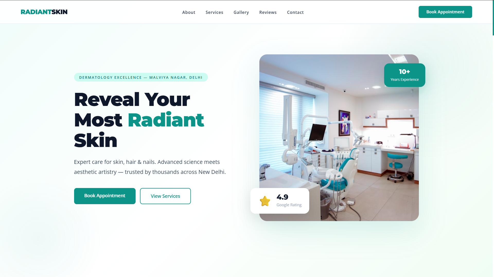
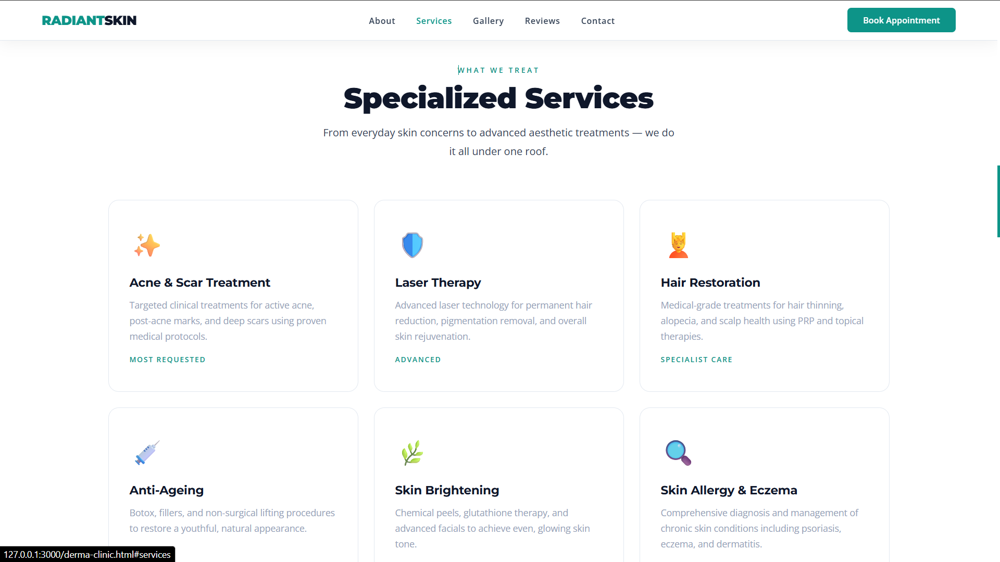
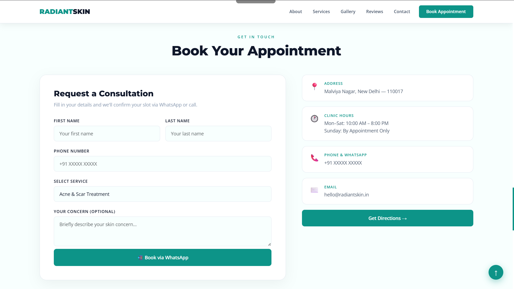

# 🏥 Skin & Dermatology Clinic Website

A modern and responsive **Dermatology Clinic Website** designed for skin care clinics, dermatologists, and medical centers to showcase their treatments, services and allow patients to easily book appointments.

This project demonstrates a clean medical UI design with clear call-to-action sections to improve patient engagement.

---

## 🌐 Live Demo

https://priyanshung1480.github.io/Derma-Clinic-Website/

---

## 📸 Website Preview

---

## ✨ Features

- Professional medical clinic design
- Hero section with call-to-action
- Dermatology services section
- About clinic section
- Doctor / clinic information
- Appointment booking section
- Responsive layout for mobile and desktop
- Clean and modern UI

---

## 🛠 Technologies Used

- HTML5  
- CSS3  
- Bootstrap  
- JavaScript  

---

## 📱 Website Sections

- Hero Section
- About Clinic
- Skin Treatments / Services
- Why Choose Our Clinic
- Appointment Booking
- Contact Section
- Footer

---

## 📂 Project Structure
clinic-website
│
├── Index.html
├── images/
└── README.md

---

## 💡 Use Case

This website can be used for:

- Dermatology clinics
- Skin care clinics
- Cosmetic clinics
- Medical centers
- Doctors and specialists
  i will Also custom it According to your needs.

---

## 👨‍💻 Author

**Priyanshu Negi**  
Frontend Web Developer

---

⭐ If you like this project, consider giving it a star on GitHub.

